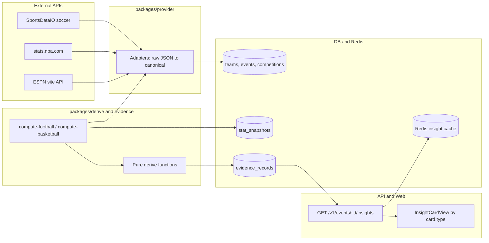

# Architecture

This document describes how the Sports Insights Platform ingests data from multiple external APIs, normalises it, computes evidence-backed insights, and serves them to the web app and REST API.

## Goals

- **Upcoming matches** in the product; **historical** game data for form, head-to-head, and betting-style widgets.
- **Multiple vendors** (SportsDataIO, stats.nba.com, ESPN) without leaking vendor JSON to clients.
- **Sport-specific** insight cards while sharing the same storage and API envelope.

## Layered overview



| Layer | Package / app | Responsibility |
|--------|----------------|----------------|
| Provider | `packages/provider` | HTTP to vendors; map to canonical types |
| Normalise | `packages/normalise` | Shared TypeScript contracts (no I/O) |
| DB | `packages/db` | Postgres schema, migrations |
| Evidence | `packages/evidence` | Upserts, evidence TTL, `buildInsightResponse`, list events |
| Derive | `packages/derive` | Sport logic from canonical stats (no HTTP) |
| Shared | `packages/shared` | Zod schemas, cache keys, `InsightResponse` |
| API | `apps/api` | Fastify routes, auth, cache |
| Worker | `apps/worker` | Ingest jobs, batch compute, one-off scripts |
| Web | `apps/web` | React UI, insight card components |

## Identity: UUIDs vs provider keys

The database uses **internal UUIDs** for joins. External entities are deduplicated with **`(provider, providerId)`**.

- **Teams, competitions, areas, events** store `provider` + `providerId` (unique per table where applicable).
- **Upserts** (`upsertTeam`, `upsertEvent`, … in `packages/evidence/src/service.ts`) look up by provider key, then insert or update.

NBA teams are stored with **`provider: "nba.com"`** and stats.nba.com team IDs (e.g. `1610612747`). ESPN uses different numeric IDs; the ESPN adapter maps via `packages/provider/src/nba-com/teams.ts` (`espnId`, `espnKey`) and still emits `CanonicalTeam` with the nba.com id so existing DB rows stay stable.

## Canonical data models

Defined in `packages/normalise`. Providers must produce these shapes; nothing above the provider layer should depend on vendor field names.

### Football (`src/models.ts`)

| Type | Purpose |
|------|---------|
| `CanonicalTeam`, `CanonicalCompetition`, `CanonicalEvent` | Schedule and catalogue |
| `CanonicalTeamStats` | Recent matches: goals, W/D/L, BTTS-related aggregates |
| `HeadToHeadStats` | Meetings with scores (optional half-time) |
| `CanonicalStanding`, `CanonicalLineup` | Ladder and lineups |

### Basketball (`src/basketball.ts`)

| Type | Purpose |
|------|---------|
| `BasketballTeamStats` | Recent matches: points, W/L, averages |
| `BasketballHeadToHeadStats` | Meetings, win counts, `avgTotalPoints` (no draws) |
| `NbaGame`, `NbaStanding` | Preview and ladder from NBA-shaped feeds |
| `BasketballPlayerSpotlight` | Player prop–style spotlight |

Football and basketball intentionally use **parallel types** (goals vs points, draws vs no draws) so derive code stays simple and type-safe.

### Football provider interface

`SportsDataProvider` in `packages/provider/src/types.ts` documents the expected football adapter surface: areas, schedules, standings, `getTeamStats` → `CanonicalTeamStats`, lineups.

Basketball uses the same *ideas* (`getTeamGameStats`, `getHeadToHeadEvents`, `getStandings`, …) implemented on `NbaComProvider` / ESPN adapter and selected in `packages/evidence/src/compute-basketball.ts` (not yet a single shared interface).

## Data providers

| Source | Location | Sport | Role |
|--------|----------|-------|------|
| SportsDataIO | `provider/src/sportsdataio/adapter.ts` | Football | Primary ingest + compute |
| stats.nba.com | `provider/src/nba-com/adapter.ts` | Basketball | Primary stats (same endpoints as [nba_api](https://github.com/swar/nba_api)) |
| ESPN site API | `provider/src/espn-nba/adapter.ts` | Basketball | Fallback when nba.com is blocked or slow |
| SportsDataIO NBA | `provider/src/sportsdataio/nba-adapter.ts` | Basketball | Legacy adapter (exported; not main path) |

### Adapter techniques

1. **Table parsing** — NBA stats APIs return `resultSets` / `rowSet`; helpers like `rowsToObjects` normalise to records.
2. **Derived fields** — e.g. opponent points from `PTS` and `PLUS_MINUS` in LeagueGameFinder.
3. **Score shapes** — ESPN nests scores as `{ value, displayValue }`; `parseScore()` unifies them.
4. **Team mapping** — static `NBA_TEAMS` links stats IDs, ESPN ids, and abbreviations (`GS` vs `GSW`).
5. **Season semantics** — `getNbaSeasonString` / `getEspnSeasonYear` align “2025-26” with each API’s season parameter.
6. **Fallback** — `NBA_PROVIDER=auto` tries nba.com, then ESPN (`compute-basketball.ts`).
7. **Degradation** — optional calls (player logs) may return empty arrays without failing the whole compute.

Environment variables are documented in the root `README.md` (`NBA_PROVIDER`, `NBA_STATS_TIMEOUT_MS`, `ESPN_NBA_TIMEOUT_MS`, `SPORTSDATAIO_API_KEY`, …).

## Persistence

Schema: `packages/db/src/schema/index.ts`.

### Relational core

- **Catalogue:** `areas`, `competitions`, `teams`
- **Matches:** `events` (`sport`, `status`, `scheduledAt`, scores, `provider`, `providerId`)
- **Context:** `standings`, `lineups`

### JSON-heavy tables

| Table | Role |
|-------|------|
| `stat_snapshots` | Raw-ish payloads from a compute run (e.g. `team_recent_form`), linked to `eventId` |
| `evidence_records` | One logical insight per `(eventId, type)`; `payload` JSONB; `expiresAt`; `sourceStatIds` → snapshots |
| `audit_logs` | API action audit trail |

Evidence rows are **replaced** on recompute (`upsertEvidence` deletes prior row for same event + type).

TTL defaults live in `packages/evidence/src/create.ts` (`EVIDENCE_TTL_MINUTES`).

## Ingest vs compute

### Ingest (worker)

Populates **who plays when** (and updates scores/status):

- Football: `apps/worker/src/jobs/ingest-schedules.ts` → SportsDataIO → `upsertTeam` / `upsertEvent` (upcoming-focused).
- NBA: `apps/worker/src/jobs/ingest-nba-schedules.ts` → nba.com scoreboard (with catalog seed from `NBA_TEAMS`).

One-off scripts: `ingest-schedules-once`, `ingest-nba-once`, `ingest:areas`.

### Compute (worker or on-demand API)

For each **upcoming** event, fetch **historical** form/H2H from live APIs, derive insights, write evidence:

| Path | Entry |
|------|--------|
| Football | `packages/evidence/src/compute-football.ts` |
| Basketball | `packages/evidence/src/compute-basketball.ts` |
| Batch jobs | `apps/worker/src/jobs/compute-insights.ts` (football), `compute-basketball-insights.ts` |
| CLI | `npm run compute:football`, `npm run compute:nba` |

**On-demand:** `getInsightResponse` (`packages/evidence/src/service.ts`) loads evidence; if `cards` is empty, calls `ensureFootballInsights` or `ensureBasketballInsights`, then rebuilds and caches.

Typical compute steps:

1. Load event and team provider IDs from DB.
2. Provider → `CanonicalTeamStats` or `BasketballTeamStats`.
3. `createStatSnapshot` for provenance.
4. `derive*` functions in `packages/derive`.
5. `upsertEvidence` per insight type.
6. `buildInsightResponse` → optional Redis cache (`CACHE_TTL.insights`).

## Derive layer

Pure functions; **no network**. Inputs are always normalised types.

| Sport | Module | Examples |
|-------|--------|----------|
| Football | `derive/form.js`, `h2h.js`, `trend.js`, `over-under.js`, `correct-score.js`, `half-results.js` | Form, H2H, BTTS, O/U 2.5, correct score, half-time |
| Basketball | `derive/basketball/index.ts` | Form, H2H, game O/U, spread cover, team total, preview, spotlight |

Shared helpers at sport boundaries: e.g. `deriveHeadToHeadFromGames` (football), `deriveBasketballHeadToHeadFromGames` (basketball) in provider package — they consume `CanonicalEvent[]` so H2H is independent of which adapter fetched games.

## Evidence → API → UI

### Evidence types → cards

Football cards are assembled in `buildInsightResponse` (`service.ts`). Basketball uses `buildBasketballInsightCards` (`packages/evidence/src/basketball.ts`).

Allowed card `type` values: `packages/shared/src/schemas/insights.ts` (`insightCardTypeSchema`).

| Evidence `type` | Typical card `type` | Sport |
|-----------------|---------------------|-------|
| `form_guide` | `form_guide` | Both |
| `h2h` | `h2h` | Both |
| `trend` | `trend` | Football (BTTS) |
| `over_under` | `over_under` | Football |
| `correct_score` | `correct_score` | Football |
| `half_results` | `half_results` | Football |
| `points_over_under` | `points_over_under` | Basketball |
| `spread_cover` | `spread_cover` | Basketball |
| `team_total` | `team_total` | Basketball |
| `player_spotlight` | `player_spotlight` | Basketball |
| `game_preview` | `game_preview` | Basketball |
| `stats`, `ladder`, `lineup` | (top-level blocks, not always cards) | Both |

### API envelope

```ts
interface InsightResponse {
  eventId: string;
  generatedAt: string;
  freshness: Record<string, string>; // ISO timestamps per insight family
  cards: InsightCard[];
  stats: Record<string, unknown>;
  ladder: Record<string, unknown>;
  lineup: Record<string, unknown>;
}

interface InsightCard {
  type: InsightCardType;
  title: string;
  evidenceIds: string[];
  payload: Record<string, unknown>;
}
```

Zod validates the **shell**; per-card payloads are typed in derive and mirrored in `apps/web/src/types.ts`.

### Web

`apps/web` calls `GET /v1/events/:eventId/insights`. `InsightCardView` switches on `card.type` and renders CSS-based charts (gauges, bars, form pills). It does not call provider APIs.

## Multi-source design patterns

| Problem | Approach |
|---------|----------|
| Different external IDs | `(provider, providerId)` + mapping tables (NBA teams) |
| Different stat semantics | Separate canonical types (goals vs points) |
| Same sport, multiple APIs | Adapters with identical output types; env-driven primary/fallback |
| Different card sets per sport | `event.sport` branch in `buildInsightResponse` |
| Vendor-specific fields | Contained in adapters and `stat_snapshots`; evidence uses derive payloads |
| Provenance | `sourceStatIds`, `stats.source` in payload (`espn`, `nba.com`, …) |
| Staleness | `evidence.expiresAt`, API `freshness`, Redis TTL on full response |

## Adding a new data source

1. Implement an adapter under `packages/provider` that returns **existing** canonical types (or extend `normalise` if the sport needs new concepts).
2. Choose `provider` string and stable `providerId` scheme; upsert into DB via evidence helpers.
3. Wire the adapter into the appropriate `compute-*.ts` (or implement `SportsDataProvider` for football).
4. Add or extend **derive** functions and **evidence types** only when introducing new insight widgets.
5. Register card `type` in `packages/shared`, card builder, and `InsightCardView`.
6. Document env vars in `.env.example` and root `README.md`.

## Related paths

```
packages/normalise/src/models.ts      # Football canonical types
packages/normalise/src/basketball.ts  # Basketball canonical types
packages/provider/src/                # Vendor adapters
packages/derive/                      # Insight math
packages/evidence/src/service.ts      # DB helpers, buildInsightResponse
packages/evidence/src/compute-*.ts    # Per-sport compute orchestration
apps/api/src/routes/events.ts         # Insights HTTP API
apps/worker/src/jobs/                 # Scheduled ingest and compute
```

For runbooks (seed, ingest, compute commands), see the root [README](../README.md).

## Embeddable widgets

HTML iframe widgets are served from the API under `/embed/v1/...` (see [embed-widgets.md](./embed-widgets.md)). The web app includes a demo page at `/matches/:eventId/embed` that previews widgets and provides copy-paste iframe snippets.
